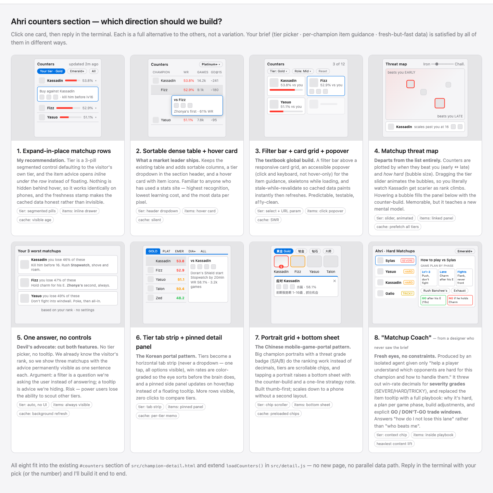

# kargnas/skills

제가 [Claude Code](https://docs.anthropic.com/en/docs/claude-code), Codex,
[OpenCode](https://opencode.ai)에서 사용하고 있는 스킬들 중 일부를 발췌하여 올렸습니다.

각 스킬은 표준 에이전트 스킬 구조인 `skills/<이름>/SKILL.md` 형태로 독립되어 있습니다.

## 전체 스킬 설치

[`npx skills`](https://github.com/vercel-labs/skills)로 모든 스킬을 한 번에 설치합니다.

```bash
npx -y skills add kargnas/skills --skill '*'
```

설치 대상을 직접 선택하려면 다음 명령을 사용합니다.

```bash
npx -y skills add kargnas/skills
```

전역 설치가 필요하면 원하는 명령 끝에 `--global`을 붙입니다.

## 개별 스킬 설치

### `ai-ready`

프로젝트를 분석해 `AGENTS.md`, 디버깅·테스트 환경, CI, 문서를 정비합니다.

```bash
npx -y skills add kargnas/skills --skill ai-ready
```

### `vscode-ready`

프로젝트 기술 스택에 맞는 VS Code/Cursor 실행, 디버그, 작업, 설정 파일을 구성합니다.

```bash
npx -y skills add kargnas/skills --skill vscode-ready
```

### `skill-manager`

스킬의 생성, 수정, 병합, 분리, 구조 정리, 외부 스킬 가져오기를 관리합니다.

```bash
npx -y skills add kargnas/skills --skill skill-manager
```

### `skill-prompter`

스킬 단계가 누락되지 않도록 RFC 2119 표현, 명시적 도구, 검증 절차, 이름과 설명을 다듬습니다.

```bash
npx -y skills add kargnas/skills --skill skill-prompter
```

### `humanizer-kill-gpt`

영어와 한국어 글에서 반복되는 GPT·LLM 특유의 문장 구조, 번역체, 과잉 설명을 제거합니다.

```bash
npx -y skills add kargnas/skills --skill humanizer-kill-gpt
```

### `git-lore`

Git trailer로 커밋의 결정 배경을 기록하고 조회하며, 프로젝트 또는 전역 에이전트 지침에 Lore 형식을 설정합니다.

```bash
npx -y skills add kargnas/skills --skill git-lore
```

### `minimal-patch-with-subagents`

버그 수정 위치를 병렬 서브에이전트들이 독립적으로 토론·투표해, 편집 전에 가장 위험이 낮은 최소 패치를 선택합니다.

```bash
npx -y skills add kargnas/skills --skill minimal-patch-with-subagents
```

### `dont-trust-my-ui-idea`

넓거나 한국 표준에 치우친 기능 아이디어를 8가지 컨셉 프리뷰로 확장해, 글로벌 표준 아이디어로 다듬습니다. 8번째 컨셉은 조건을 전혀 모르는 클린 컨텍스트 서브에이전트가 처음부터 다시 상상합니다.

내장된 로컬 서버가 컨셉을 브라우저에 띄우고, 클릭한 컨셉을 기록합니다. 비교 목적에 따라 카드, 나란히 놓은 목업, 실제 화면 크기의 프리뷰를 사용합니다. 레이아웃은 와이어프레임으로, 시각적 완성도는 글꼴·간격·색상·이미지를 갖춘 목업으로 비교합니다. 아래는 "챔피언 상세 페이지의 카운터 섹션에 티어 필터, 아이템 툴팁, 캐싱을 넣고 싶다"는 요청의 카드형 프리뷰 예시입니다.



```bash
npx -y skills add kargnas/skills --skill dont-trust-my-ui-idea
```

### `design-frontend-sangrak`

디자인 시스템이 없는 프로젝트의 프론트엔드 기본값입니다. 토큰, 밀도 스케일, 안티 슬롭 규칙에 더해 컨테이너 쿼리 기반 반응형 규칙(좁은 창 ≠ 모바일, `pointer: coarse`로만 폰 전용 처리)과 UX 법칙 11개를 판정 규칙과 코드 냄새 한 줄씩으로 담았습니다. 리뷰 모드에서는 Vercel Web Interface Guidelines와 함께 `file:line` 형식으로 지적합니다.

```bash
npx -y skills add kargnas/skills --skill design-frontend-sangrak
```

## Claude Code 플러그인으로 설치

Claude Code에서는 이 저장소를 플러그인 마켓플레이스로 추가할 수도 있습니다.

```text
/plugin marketplace add kargnas/skills
```

```text
/plugin install kargnas-skills@kargnas-plugins
```

## Codex 플러그인으로 설치

Codex CLI 0.146.0 이상이 필요합니다. Codex는 `.agents/plugins/marketplace.json`을 먼저 읽으며, 이 파일은 `npm run version:sync`가 `.claude-plugin/` 매니페스트에서 자동 생성합니다.

```bash
codex plugin marketplace add kargnas/skills
```

```bash
codex plugin add kargnas-skills@kargnas-plugins
```

## 스킬 목록

| 스킬 | 용도 |
| --- | --- |
| [`ai-ready`](skills/ai-ready/) | 프로젝트를 AI 에이전트가 작업하기 쉬운 구조로 정비 |
| [`vscode-ready`](skills/vscode-ready/) | VS Code/Cursor의 실행·디버그·작업 설정 생성 |
| [`skill-manager`](skills/skill-manager/) | 스킬 구조와 전체 생명주기 관리 |
| [`skill-prompter`](skills/skill-prompter/) | 스킬 지시문의 실행 준수율과 트리거 문구 개선 |
| [`humanizer-kill-gpt`](skills/humanizer-kill-gpt/) | 영어·한국어 글의 GPT·LLM 문체 흔적 제거 |
| [`git-lore`](skills/git-lore/) | Captures, queries, and configures decision context in native Git trailers |
| [`minimal-patch-with-subagents`](skills/minimal-patch-with-subagents/) | 병렬 서브에이전트 토론으로 확정된 버그의 최소·최저위험 패치 선택 |
| [`dont-trust-my-ui-idea`](skills/dont-trust-my-ui-idea/) | Transforms a broad/non-standard idea into a global-standard idea with an eight-concept preview |
| [`design-frontend-sangrak`](skills/design-frontend-sangrak/) | 디자인 시스템 기본값 + 컨테이너 쿼리 반응형 규칙 + 적용형 UX 법칙, 빌드/리뷰 두 모드 |

## 라이선스

[PolyForm Noncommercial 1.0.0](LICENSE)에 따라 개인, 연구 및 기타 비상업적
용도로 무료 사용할 수 있습니다. 상업적 이용에는 저자의 별도 허가가 필요합니다.
